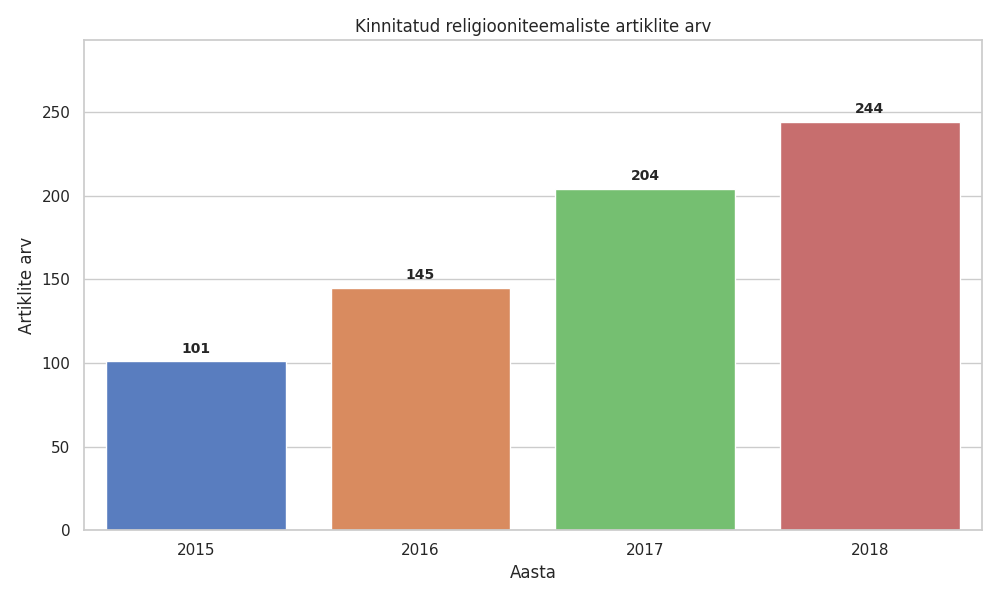
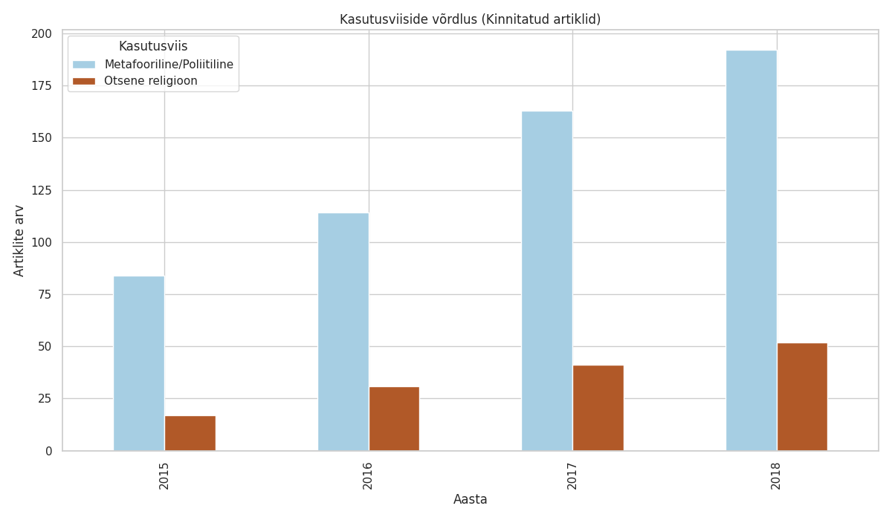
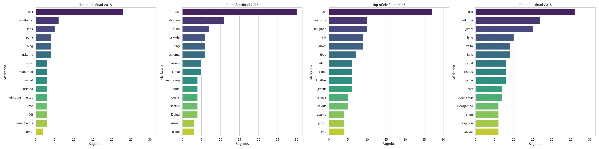

Aastavahetusel tekkis vaidlus, et milline on ikkagi eestlaste suhtumine religiooni ja religioossetesse teemadesse. Lõpuks tundus, et ei jää midagi muud üle kui tuleb ette võtta mingi analüüs. Lasin LLM-il kirjutada kraapija ning alla laadida viimase 10 aasta ERR-i arvamusartiklid (kokku ca 80Mb materjali), märksõnade abil välja filtreerida artiklid, kus mainitakse religioosseid teemasid (5556 artiklit) ning siis lasta järgmisel LLM-il analüüsida sentimenti (Gemini 3 Flash mudeliga).

LLM analüüs on hetkeseisuga tehtud aastate 2015-2018 kohta. Kogu andmestikust on aga näha, et ERR on hakanud rohkem arvamusartikleid avaldama (või on hakanud inimesed neid lihtsalt rohkem kirjutama) – 2018. aastal toimus märgatav hüpe:

| Aasta | Arvamusartikleid kokku |
|:------|:-----------------------|
| 2015  | 303                    |
| 2016  | 377                    |
| 2017  | 590                    |
| 2018  | 733                    |
| 2019  | 1407                   |
| ...   | ...                    |
| 2025  | 1311                   |

Alustasin odavuse mõttes esimestest aastatest (analüüs maksab, mis teha), aga sealt koorub juba midagi välja. Järgnev on suuresti Gemini 3 abil loodud kokkuvõte analüüsitud materjalidest.

### 1. "Ühe kolmandiku seadus" – religioosse retoorika stabiilsus

Analüüs näitab, et religiooniteemalised artiklid (sh metafoorne ja poliitiline kasutus) moodustavad stabiilselt umbes **kolmandiku** kõigist arvamusrubriigi artiklitest. Hoolimata sellest, et artiklite koguarv on kasvanud, püsib religioosse sõnavara suhteline osakaal üllatavalt muutumatuna.

| Aasta | Arvamusartikleid kokku | Kinnitatud religiooniteema | Osakaal (%) |
|:------|:-----------------------|:---------------------------|:------------|
| 2015  | 303                    | 101                        | 33.33%      |
| 2016  | 377                    | 145                        | 38.46%      |
| 2017  | 590                    | 204                        | 34.58%      |
| 2018  | 733                    | 244                        | 33.29%      |

**Märkus:** Kinnitatud artiklite hulka kuuluvad nii otseselt religioonist rääkivad artiklid kui ka need, kus religioosset sõnavara kasutatakse metafoorselt (nt "poliitiline dogma", "püha tõde", "usk riiki"). See stabiilsus viitab fenomenile, et religioossed metafoorid on üsna püsiv osa arvamusretoorikast.

### 2. Sõnavara "politiseerumine" ja metafoorid

Kõige silmatorkavam pikaajaline trend on see, et **religioossete terminite kasutus kasvab, aga religioonist endast räägitakse (suhtarvuna) vähem.**

*   **Metafooride kasutus:** Nagu graafikult "Kasutusviiside võrdlus" näha, domineerib metafooriline/poliitiline kasutus mäekõrguselt otsese religiooni üle. 2018. aastal on vahe küll veidi vähenenud (tänu paavsti visiidile ja Mangi skandaalile, mis klassifitseeruvad otsese religiooni/usundi alla), kuid trend on selge.

*   **Miks see juhtus?** Aastad 2016 ja 2017 olid "tõejärgse ajastu" (*post-truth*) ja populismi tõusu aastad. 2018. aastal lisandusid sinna EV100 pidustused, mis tõid kaasa "pühaduse" ja "usu" (Eesti riiki) retoorika kasvu ilmalikus võtmes. Lisaks toimus 2018 sügisel paavsti visiit.
*   **Kuidas see väljendub?** Ajakirjanikud ja arvamusliidrid kasutavad religioosset sõnavara, et kirjeldada olukordi, kus ratsionaalsed argumendid näivad kaduvat või kus on vaja rõhutada erilist pidulikkust.
    *   *Näited:* "Poliitiline liturgia", "partei jüngrid", "dogmaatiline majanduspoliitika", "pime usk juhisse".
    *   **Järeldus:** Sõna "usk" ei tähenda neis tekstides enamasti usku Jumalasse, vaid **usaldust** (või selle puudumist) riigi, institutsioonide ja poliitikute vastu.

### 3. Vaenlase kuju ja fookuse muutumine: "võõras" vs "loll"

Huvitav on jälgida, kuidas muutuvad märksõnad ja kelle vastu on suunatud teravik.

*   **2015 – Hirm välise ees (Islam):** Fookuses on pagulaskriis ja Pariisi terrorirünnakud. Märksõnad "moslemid" ja "islam" on tipus.
*   **2016/2017 – Hirm sisemise rumaluse ees (esoteerika ja "uhhuu"):** Tekib uus teema – teadus vs. uskumus.
*   **2018 – Identiteet ja tõde:** 2018. aasta toob jälle uue dünaamika. Ühelt poolt tekitas **EV100** laine positiivse "pühaduse" kasvu (märksõnad "vaim", "hing", "Maarjamaa"). Teiselt poolt asendus hirm islami ees siseriikliku võitlusega **esoteerika ja pseudoteaduse** (Igor Mangi skandaal, MMS) vastu.

Sõna "tõde" esiletõus (eriti 2017-2018) on otsene reaktsioon "tõejärgsele" poliitikale. Religioosselt tajutav terminoloogia ("tõekuulutaja", "ainutõde") on muutunud vahendiks, millega dekonstrueerida poliitilisi narratiive. 2018. aastal tõuseb märksõnades esile ka "paavst", mis peegeldab Franciscuse visiiti.

### 4. Kiriku rolli muutumine

*   **2015:** Kirik on pigem passiivne või konservatiivne jõud.
*   **2017:** Toimub esilekerkimine seoses reformatsiooni 500. aastapäeva ja **Annika Laatsi** kaasusega. Tekib sisedebatt "liberaalse" ja "konservatiivse" tiiva vahel.
*   **2018**. aastal on kiriku ja religiooni kajastus rahulikum ja positiivsem. Paavst Franciscuse visiiti kajastati valdavalt lugupidavas ja lepitavas toonis, erinevalt varasematest väärtuskonfliktidest.

### 5. Sentimendi pööre 2018. aastal

See on ehk kõige huvitavam leid. Graafik "Hinnangute jaotus" näitab, et kui 2017. aasta oli "viha aasta" (negatiivne/kriitiline toon tipus 34.3%), siis **2018. aastal toimus märgatav nihe positiivsuse suunas.**

*   **Negatiivne:** Langes 34.3% -> 25%
*   **Positiivne:** Tõusis 11.3% -> 20.9%

")

**Miks muutus toon 2018. aastal positiivsemaks?**
1.  **EV100 efekt:** Juubeliaasta tõi kaasa palju pidulikke tekste, kus räägiti "usust Eestisse", "pühast maast" ja "vaimsusest" ülevas ja toetavas võtmes.
2.  **Paavsti visiit:** See sündmus ei tekitanud ühiskondlikku lõhet, vaid pigem uudishimu ja heakskiitu.
3.  **Iroonia stabiliseerumine:** Irooniline kasutus on jäänud madalamale tasemele (~14%). See viitab, et religioosne sõnavara on muutunud tõsiseltvõetavamaks vahendiks väärtuste kirjeldamisel.

### 6. Huvitavad üksikleiud CSV-dest:

*   **Sport ja kultuur kui religioon:** Eriti 2017-2018 artiklites (laulupeo kajastused) kasutatakse religioosset sõnavara ("püha", "liturgia", "ülevus") positiivses võtmes sekulaarsete sündmuste kirjeldamiseks. Laulupidu on eestlase "kirik".
*   **Ida-Virumaa "usk":** Eraldi teemana jookseb läbi Erik Gamzejevi ja teiste artiklid Ida-Virumaast, kus "usk" tähendab sageli lootusetust või vastupidi – pimedat lootust riigi abisse ("hädaorg").
*   **Majandusdogmad:** Viktor Trasberg ja teised majandusanalüütikud kasutavad järjekindlalt sõnu "dogma", "mantra" ja "pühakiri", et kritiseerida neoliberaalset majanduspoliitikat (nt tasakaalus eelarve kui "püha lehm").
*    **Tehnoloogiline messianism**   Gustav Lauringson (26.09.2018): Kasutab termineid nagu "sakraalne missioon", "Infosfääri Jumal" ja "apologeetika", et kirjeldada Eesti digitaliseerimispoliitikat. See on suurepärane näide sellest, kuidas "usust" on saanud vahend tehnokraatia kritiseerimiseks.

**Kokkuvõtlikult:**
Andmestik (2015–2018) näitab, kuidas Eesti avalik ruum "religiooni" mõistet kasutab eelkõige metafoorselt.
*   **2015:** Usk kui **"julgeolekuoht"** (islam).
*   **2016/2017:** Usk kui **"poliitiline relv"** ja **"ühiskondlik lollus"** (dogmatism, esoteerika).
*   **2018:** Usk kui **"identiteet ja pühadus"**. EV100 ja paavsti visiit tõid religioosse sõnavara tagasi positiivsesse, ühendavasse ja pidulikku konteksti, leevendades varasemate aastate teravat kriitikat.

## Suhtumine ##

Üldiselt joonistub välja muster, kus religioosset sõnavara kasutatakse poliitilises ja ühiskondlikus debatis **"ratsionaalse" ja "irratsionaalse" vastandamiseks**. Selles vastanduses tähistab religioosne terminoloogia (usk, dogma, jüngrid, sekt) peaaegu alati "rumalamat", kriitikavaba või tagurlikku poolt, samas kui ilmalik/teaduslik pool on "tark".

### 1. "Pime usk" kui ratsionaalse mõtlemise puudumine
Kõige levinum võte on sildistada oponendi seisukoht "usuks", et diskvalifitseerida see kui argumenteerimatu emotsioon. "Usklik" on siin kontekstis sünonüümne sõnaga "naiivne" või "manipuleeritav".

*   **2015-01-30 Mari-Liis Jakobson:** Autor heidab poliitikutele ette "ratsionaalsete argumentide asendamist **pimeusu** ja populistlike lubadustega". Siin on selge vastandus: ratsionaalne = hea, pimeusk = halb/rumal.
*   **2015-07-24 Rauno Vinni:** Pagulasvastaste kriitika. Autor võrdleb nende veendumusi **"pimeusuga"** ja kasutab väljendeid nagu **"usu kuulutamine"**. Sõnum: pagulasvastasus ei ole faktipõhine, vaid emotsionaalne (st rumal) uskumus.
*   **2015-07-01 Erik Gamzejev:** Plagiaadiskandaali kontekstis küsitakse "Kes usub Valeri Korbi?", viidates **"pimeusule"** ja faktide eiramisele. Uskumine võrdub siin faktide eitamisega.
*   **2015-02-14 Alari Rammo:** Kasutab sõna "uskuma" seoses valijatega, kes usuvad "pudrujõgesid". Siin on usk võrdsustatud valija **kergeusklikkuse ja rumalusega**.

### 2. "Dogma" kui intellektuaalne seisak ja jäikus
President Toomas Hendrik Ilves ja mitmed analüütikud kasutavad religioosseid termineid nagu "dogma" või "müüt", et kirjeldada poliitilist paindumatust või suutmatust ajaga kaasas käia.

*   **2015-02-24 President Ilves:** Kasutab väljendeid **"piiblidogmad"** ja "dogmad", et kritiseerida ühiskondlikku jäikust. Ta vastandab sellele "hariduse ja tõe". Sõnum: dogma (religioon) takistab haridust (tarkust).
*   **2015-01-15 President Ilves:** Kritiseerib **"müütilist usku"** ja **"irratsionaalset dogmatismi"** riigijuhtimises.
*   **2015-08-07 Annika Uudelepp:** Kasutab sõna **"dogmaatiline"**, et kritiseerida jäika ja argumentideta seisukohtade kaitsmist.

### 3. Poliitilised toetajad kui "jüngrid" ja partei kui "sekt"
See on eriti terav kategooria, mida kasutatakse poliitilise lojaalsuse naeruvääristamiseks. Kui keegi toetab kedagi liiga innukalt, muutub ta metafoorselt usuhulluks.

*   **2015-10-02 Mari-Liis Jakobson:** Üks ilmekamaid näiteid failis. Savisaare toetajaid võrreldakse **"viimsepäevakuulutaja jüngritega"** ja erakonda **"sektiga"**. Kasutatakse väljendeid "pime fanatism". See on otsene rünnak: toetaja ei ole ratsionaalne kodanik, vaid manipuleeritud sektiliige.
*   **2015-04-27 Rain Kooli:** Kasutab terminit **"jüngrid"**, et kritiseerida erakondade poliitilist retoorikat.
*   **2015-10-23 Juhan Kivirähk:** Kirjeldab Savisaare ümber toimuvat kui **"pühakuks ülendamist"** ja **"rituaali"**. Eesmärk on näidata toimuvat absurdsena.
*   **2015-11-27 Kaupo Meiel:** Irooniline artikkel Keskerakonna kongressist, kasutades sõnu "lunastaja", "püha tuli", "taastulekuime". Naeruvääristamine toimub läbi religioosse pidulikkuse omistamise banaalsele poliitikale.

### 4. Majanduspoliitika kui "ebajumal"
Huvitav alaliik on majandusliberalismi või riigimeeste eksimatuse kriitika läbi religioosse prisma.

*   **2015-11-19 Priit Roosimägi:** Räägib ametnike **"kummardamisest"**, **"ilmeksimatusest"** ja "usust" riiklikesse regulatsioonidesse. Sõnum: usk riigi/ametniku tarkusesse on sama rumal kui usuline kummardamine.
*   **2015-08-26 Erik Gamzejev:** Irooniline viide turumajandusele kui **"kõikvõimsale"**, pilkades usku turu iseregulatsiooni.

### Erandid, mis kinnitavad reeglit
Selgelt on ka juhtumeid kus sõna "usk" *ei ole* halvustav. See juhtub siis, kui "usk" tähendab "lootust" või "moraalset selgroogu" (mitte pimedat kuuletumist).

*   **2015-03-30 President Ilves:** Räägib põhiseaduslikust **"kõikumatust usust"**. Siin on usk positiivne, sest see on seotud *põhimõtetega*, mitte *dogmadega*.
*   **2015-03-13 Kätlin Konstabel:** **"Tahaks uskuda"** inimlikku headusesse. Siin on usk emotsionaalne ressurss, mitte intellektuaalne puue.

### Kokkuvõte

Artiklite sentiment näitab üldisemat suundumust, et Eesti arvamusliidrid kasutavad religioosset sõnavara metafoorse relvana.

**Mehhanism on järgmine:**

1.  Võta poliitiline nähtus, mida pead rumalaks või ohtlikuks (populism, bürokraatia, liigne lojaalsus).
2.  Kleebi sellele religioosne silt (usk, dogma, sekt, jüngrid, altar).
3.  Eelduseks on lugeja vaikiv nõusolek, et *religioosne mõtlemine on madalam kui ratsionaalne mõtlemine*.
4.  Järeldus: Sildistatud poliitiline nähtus on rumal/tagurlik.

Seega, "usklik" on nendes tekstides tõepoolest tihtipeale koodnimetus **"lollile" või "kriitikavabale" inimesele.**