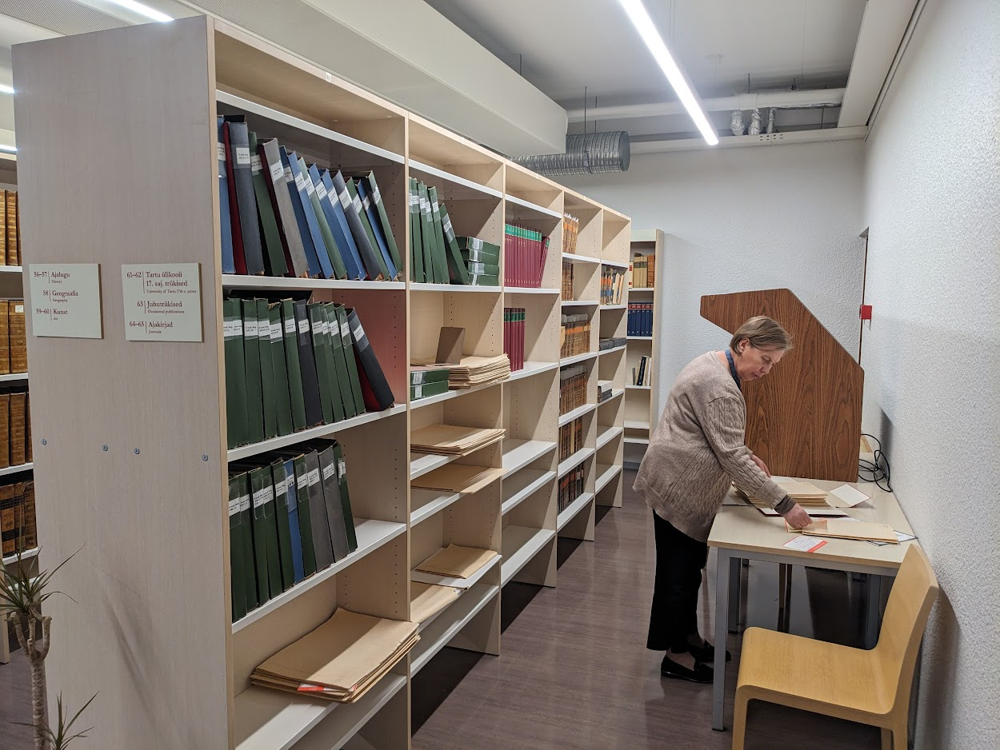

Olukord - meil on mitu riiulimeetrit (see on niisugune arhiivinduses kasutatav mõõtühik) paberkoopiaid Academia Gustaviana ja Academia Gustavo-Carolina trükistest. Need on kogutud kokku peaaegu eranditult Ene-Lille Jaansoni ja Mare Ranna poolt, raamatu **Ene-Lille Jaanson, toim., Tartu Ülikooli trükikoda 1632-1710: Ajalugu ja trükiste bibliograafia = Druckerei der Universität Dorpat 1632-1710: Geschichte und Bibliographie der Druckschriften, koos Mare Rand *et al.* (Tartu Ülikooli Raamatukogu, 2000)** kirjutamisel ja koostamisel. Nad kõndisid kahekesi läbi kõik Rootsi ja Soome ja Läti ja Peterburi ja ilmselt veel mõned raamatukogud, tegid paljundused ja tassisid need paberilehed käe otsas Tartusse. Nagu teab rääkida Malle Ermel tunti neid Rootsis "estniska damen" nime all ning need kaks daami leidsid üles peaaegu kõik meie varauusaegse ülikooli trükikojas trükitud materjalid.

 
Minu teada pole teist sellist kollektsiooni veel kusagil mujal tehtud. Küll on võetud ette ja loodud kogu nt Helmstedti või Turku ülikooli disputatsioonidest, aga need kogud ei sisalda plakateid, või oratsioone, või programmasid või juhutrükiseid, mida trükiti tähelepanuväärsete sündmuste puhul (ülikooli avamine, inimese lahkumine, surm, abiellumine vms). Ene-Lille Jaansoni loodud Tartu/Pärnu trükiste kataloog annab juba pealkirjadena suurepärase läbilõike sellaegsest akadeemilisest elust, trükikoja profiilist ja muutuvatest aegadest. Aga peale pealkirjade on tegelikult võimalik vaadata ka kujunduse muutust ning vist mitte kõige viimases järgus ka sisu ennast ja selle muutust ajas.

Mahult ei ole see väga suur kogu, umbes 14 000 a4 ja a3 formaadis paberit, neist paljude puhul aga on koopia tehtud paarislehekülgedest, seega vahest on kokku umbes 20 000 üksikut lehekülge, mõned plakatisuurused, mõned üsna väikesed oktaavformaadis lehed. Nagu Roomet Jakapi teatava üllatusega kommenteeris - seda on ainult umbes 20 korda rohkem kui 1766. aastal trükitud Christian August Crusiuse peateose "Entwurf der notwendingen Venunftwahrheiten" mahtu. Mis oli täpselt 1000 lk pikk. Siiski, 20 Crusiust ei ole 17. sajandi Eestis väike saavutus. 

Kõik need Crusiused seisid Tartu ülikooli raamatukogu Rariora saali nurgas aastanumbri järgi sorteeritud mappides riiulites ning see kogu oli ligipääsetav vaid neile, kes esiteks üldse teadsid selle olemasolust ja tulid Tartusse koha peale neid vaatama. 

Ühel ja teisel moel arutati selle üle, et praegusel digiajastul peaks ette võtma ja kordama Ene-Lille Jaansoni ja Mare Ranna vägitükki digitaalselte vahenditega ja hankima endale kvaliteetsed digikoopiad - arvestades tehnilisi vahendeid, võiks see olla lihtsam kui kõik raamatukogud ise läbi tuulata. Ometi võib siin kohe ette laduda pika nimekirja takistavaid asjaolusid alatest rahast, kuni selleni, et raamatukogude töötajad ei pruugi kõiki neid materjale ise üles leida ja lõpetades tõdemusega, et Venemaa raamatukogud pole praegusel ajal üldse ligipääsetavad.   

Lõpuks digiteeriti TÜ raamatukogus ära kõik need paljundused.

Digiteeringute juures oli vaid paar probleemi. Nimelt oli keeruline digiteerijatel kõiki materjale sorteerida ning need sattusid lihtsalt kataloogi vastavalt kaustale.

Lisaks olid pildid ka erineva orientatsiooniga, mõned õiget pidi, paljud aga külili või 180 kraadi keeratuna.

Siin on ka ilusasti näha asjaolu, et failinumbri järgi ei ole võimalik kindlaks teha, kus dokument algab ja kus lõpeb, algusnumbriks võis olla suvaline lehekülg (antud juhul image_0001.jpg ja image_0006.jpg).

## Lehekülje orientatsioon ##

Enne kui hakata nende tekstide edasise analüüsiga tegelema oli kõigepealt vaja need õiget pidi keerata. See osutus üllatavalt keeruliseks ülesandeks, sest nagu näha ei katnud skänn kogu lehekülge vaid ainult osa sellest ning igasuguseid automaatseid lehekülje orientatsiooni tuvastavaid algoritme ajas see täiesti segadusse. 

Õnneks oli mõtteloo õppetool vahepealsel ajal hankinud uue arvuti, millel oli 32 Gb mäluga NVIDIA RTX 5090 GPU. Sellega on võimalik jooksutada lokaalseid LLM-e ning pärast katsetamist tundus, et kõige paremaid tulemusi annavad Gwen3-VL mudelid. 

Niisiis sai kõik leheküljed ette antud Qwen3-VL-8B mudelile, kes pidi lihtsalt ütlema, millise nurga all tekst on, selle info json faili salvestama ja järgmine skript keeras lehed lõpuks selle järgi õigeks. Niisugune tehnika osutus kõige täpsemaks, aga mitte ilmeksimatuks ja isegi praegu selle artikli kirjutamise hetkel on ilmselt meie kogus õigeks keeramata lehekülgi. Samas 14000 lehe käsitsi läbikäimine tundus pisut liiga tüütu, just selliste ülesannete jaoks ju LLM-id peaksidki olema.

## Tekstituvastus ##

Järgmine loogiline samm oleks jagada õigeks keeratud skännid teoste kaupa kataloogidesse, aga kohe alguses oli selge, et ka seda tegevust oleks vaja automatiseerida, sest failinime järgi seda teha ei saa. Oli kaks valikut, kas ise otsustada ja kopeerida käsitsi või lasta seda teha LLM-il. Tekstituvastus oli aga niiehknaa plaanis teha - ja kui tekst on tuvastatud, siis saab lasta LLM-il otsustada, kus dokument algab ja kus lõpeb. 

Tekstituvastuse jaoks sai katsetatud head hulka mudeleid, alates tasulistest Google omadest ja lõpetades kohalike mudelitega. Ükski ei olnud neist sellel hetkel (suvi 2025) päris täiuslik ja olles kuulnud, et peenhäälestamine annab häid tulemusi, otsustasin katsetada meie olemasoleva materjaliga. 

Esiteks kuhjasin kokku suhteliselt süsteemitult kõike, mis meil sScriptoriumis oli üle vaadatud ja katsetasin ridade kaupa treenimist (nagu [unslothi](https://unsloth.ai/docs/models/qwen3-vl-how-to-run-and-fine-tune) juhendis kirjas). See oli küllalt paljulubav ja töötas hästi vähese hulga teksti peal, aga kui testisin meie vägagi eripalgelisel materjalil, siis selgus, et mudel kipub teksti vahele jätma, "unustab" mõned read ja satub muul moel segadusse. Vahemärkusena niipalju, et Transkribuse ja eScriptoriumi mudelid on kõik treenitud ridade kaupa ning nõuavad eelsegmenteerimist, teisisõnu etteütlemist, et kus read on, mida on vaja lugeda. Ridade tuvastamine on teada-tuntud tülikas ülesanne, mis näib lihtsana, aga pole seda prügise materjali puhul sugugi mitte.

Siis tuli mulle meelde, et [Benjamin Kiessling](https://zenodo.org/records/15764161) oli treeninud Llama 3.2 mudeli lehekülje kaupa teksti tuvastama (mis aga endiselt nõudis eelsegmenteerimist). Lihtsalt testiks proovisin meie materjaliga Qwen3-VL mudelit lehekülje kaupa treenida ilma segmenteerimata ning tulemused olid üllatavalt head. Järgmiseks otsisin võrgust ja meie materjalidest kokku nii palju enamvähem ühtlase stiiliga transkribeeritud ja kontrollitud materjali kui võimalik ja treenisin mudeli 1500 lk ladina ja prantsuse antiikva, varauusaegse kreeka keele, Saksa ja Rootsi fraktuuri peal. Selle mudeliga saigi ühe nädalavahetusega kõik skännitud lehed üle käidud. Fraktuuri treeningmaterjal on kõige kõhnem ning see annab tulemuste puhul tunda - seal on rohkem eksitusi. Üldiselt aga pole viga, mudel hakkas isegi käsitsi kirjutatud kreeka keelt tuvastama (need Marju Lepajõe käekirjaga kirjutatud perfokaardid) ja sai hakkama ka 1689. aasta konstitutsioonide käsikirjalise teksti tuvastamisega (seal on aga küllalt palju vigu). 

Siiski pigem üllatavalt hea tulemus, arvestades, et käsikirjalise tekstiga ei treeninud ma mudelit üldse.

## VUTT ##

Kui tuvastustöö tehtud, siis seisis kogu materjal tükk aega niisama. Olid küll mingid plaanid, et tuleks see teha kättesaadavaks, aga küsimus oli, kuidas? Sügisel aga tulid suhteliselt koos välja Google stuudios võimalus luua rakendusi ja Claude 4.5 Opus. Kirjeldasin oma mõtet ja nii sai umbes kuu ajaga valmis tehtud lehekülg, millele sai nimeks [VUTT (**V**ara**U**usaegsete **T**ekstide **T**öölaud)](https://vutt.utlib.ut.ee/). Logo soovitas Rahel Toomik ja see pärineb dokumendist _Een kort och enfaldigh Lijkpredikan ... Dorpt: J. Vogel, 1642_.

Töötab otsing (hajus, ei pea kõik olema väga täpne). Kõik pildid ja tekstid on kataloogides, mitte kusagil andmebaasis, st need on lihtsalt hallatavad ja kopeeritavad ja VUTT näitab skännitud pilti ja LLM-iga tuvastatud teksti kõrvuti - teksti on võimalik sealjuures parandada ja annoteerida. See tähendab, et on olemas ka (erinevate) õigustega kasutajad. Prooviks on sinna juba lisatud ka 1689. aasta konstitutsioonid ja vennastekoguduse 1759. aasta päevik. Ma tõesti loodan, et see asi osutub kasulikuks.

Asi on ka Githubis, [https://github.com/meelisf/VUTT](https://github.com/meelisf/VUTT)